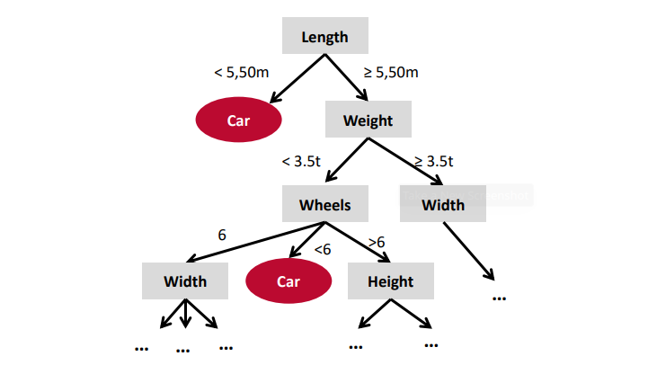

- Ein [[Supervised Learning]] Ansatz der sich besonders gut zur Klassifizierung und kategorische Variablen eignet. Die Modelle haben in der Regel eine gute [[Interpretierbarkeit]].
- Ein Entscheidungsbaum besteht aus
	- **Knoten**
	- **Kanten** => Entscheidungen
	- **Blätter** => Klassen
- 
- Die Baumstruktur wird **aus den Trainingsdaten erlernt**
- Werden mehrere Bäume mit zufälligen Grunddaten angelernt, spricht man von einem [[Random Forrest]].