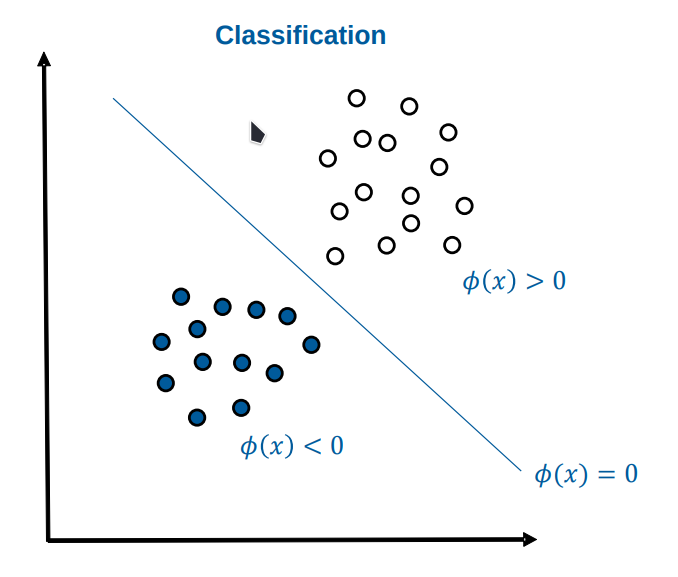

- Eine Funktion, die für jeden Datensatz einen Score für jede Klasse berechnet
- Die Funktion trennt die Datensätze in verschiedene Bereiche (sogenannte **Decision Areas**)
- 
- Die Decision Boundary $$\Phi$$ trennt die beiden Klassen. Es folgt
	- Wenn $$\Phi(x)$$ < 0, dann blau
	- Wenn $$\Phi(x) > 0$$, dann weiß
	-