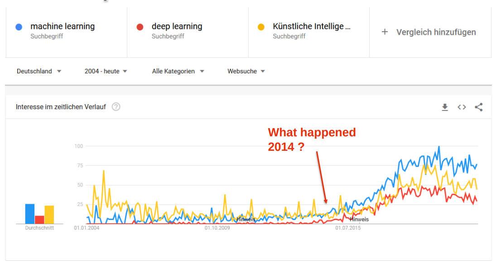
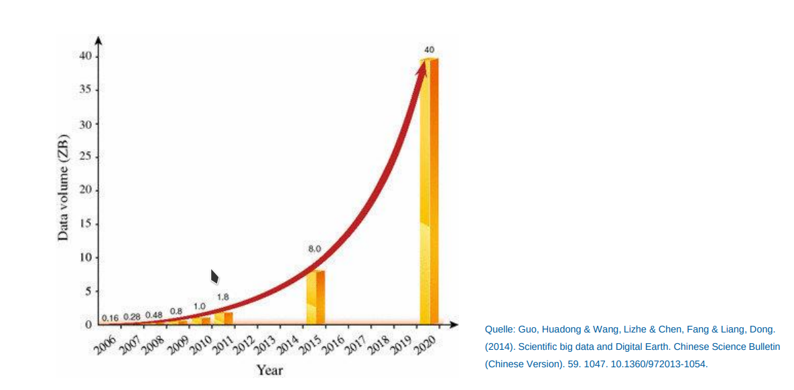
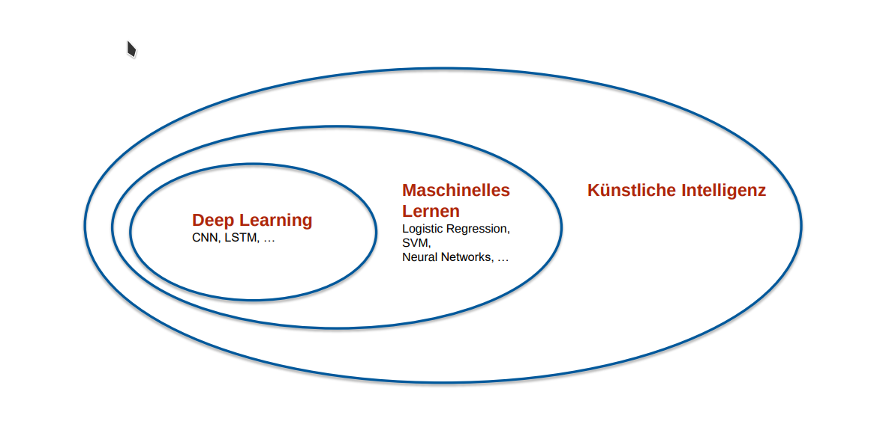

- 
- 2014 wurde ein neues DL-Verfahren veröffentlicht.
- Viele Firmen verdienen inzwischen sehr viel Geld mit Machine Learning (auf das sie nicht verzichten werden in Zukunft)
- 
- Die Datenverfügbarkeit steigt exponentiell an => Mehr Daten für ML
- 
- Die 3 Begriffe [[Machine Learning]], [[Deep Learning]] und [[Künstliche Intelligenz]] sind **keine synonyme**
- Die Modelle untescheiden sich oft in der [[Interpretierbarkeit]]