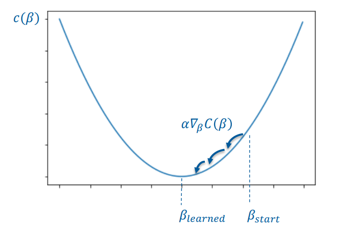

- Bei einer gewissen Anzahl von Features wird es schwierig das Minimum rechnerisch durch lösen der Gleichung zu ermitteln
- 
- Die Parameter müssen so gewählt werden, sodass der Wert der Konstenfunktion minimal ist
- Eine anschauliche Möglichkeit ist das **sprunghafte Annähern/Herantasten** an das Minimum der Kostenfunktion.
- # Problematik
	- Bei welchen Wert beginnt man?
	- In welche Richtung _geht_ man?
	- Wie groß sind die Sprünge?
	- Woher weiß ich, ob ich das globale Minimum erreicht habe?
- # Lösungsanätze
	- Man arbeitet mit der Steigung am aktuellen Punkt, da man _ins Tal wandern_ möchte, um das Minimum zu erreichen => Man benötigt die Ableitung der Fehlerfunktion.
	- Man muss an einem beliebigen Punkt starten => Zufällige Werte für $$\beta$$
	- Die Sprunggröße orientiert sich an der Steigung
	- Eine **Lernrate** wird eingeführt, die die Sprunggröße begrenzt => Eine Kontrollierte Sprunggröße ist wichtig {{cloze zuerst etwas größer und dann immer kleiner}}. Daraus ergibt sich: #card
	  card-last-interval:: 4
	  card-repeats:: 1
	  card-ease-factor:: 2.6
	  card-next-schedule:: 2022-04-16T07:08:59.937Z
	  card-last-reviewed:: 2022-04-12T07:08:59.939Z
	  card-last-score:: 5
		- Zu hohe Lernrate => Minima werden übersprungen
		- Zu kleine Lernrate => Minima werden nicht erreicht oder es dauert länger
- # Beispiel
	- $$C=\sum_{i=1}^{n}(y_i - f(x_i))^2 = \sum_{i=1}^{n}(y_i - \beta_0 - \beta_1*x_1)^2$$
	- $$\frac{\partial C}{\partial \beta_1}=\sum_{i=1}^{n}2*x^i*(y_i-\beta_0 - \beta_1*x_i)$$
	- Dabei ist $$n$$ die Anzahl der Trainingsdate
	- Man optimiert die Parameter einzeln
	- 1) Man optimiert den Parameter $$\beta_0$$
		- Es gilt $$\frac{\partial C}{\partial\beta_0}=-1500$$ bei $$\beta_1=10, \beta_0=0$$ und $$\alpha=0.1$$
		- Dann ergibt sich die Stepsize $$s=-1500*\alpha=-150$$
		- Die neuen Werte sind $$\beta_{0_{neu}}=\beta_0 - s = 150$$
		- Dieser Prozess wird wiederholt.
	- 2) Man optimiert $$\beta_1$$ nach dem selben Prinzip
		- => Ableitung am Punkt
		- => Verrechnung mit Stepsize
		- => Errechnung des neuen Punktes durch $$neu=alt - step$$
- # Varianten
	- {{embed [[Stochastic Gradient Descent]]}}