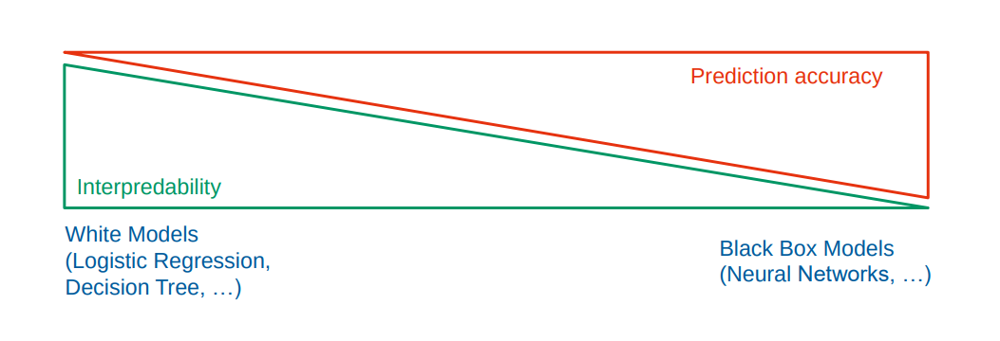

- 
- Wie gut kann das Modell nachvollzogen werden?
- Je komplexer das Modell ist, desto schwieriger kann man dieses Interpretieren.
- Im Gegensatz hierzu seht ein **Black-Box** Modell, das nicht oder sehr schwer interpretierbar ist.