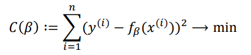

- Eine lineare Gleichung $$f(x)=a*x + b$$ wird gesucht, die einen **möglichst geringen summierten-quadratischen Fehler aufweist**.
- # Fehlerfunktion
- _sum of squared errors_
- 
- Man Berechnet den Abstand vom Ermittelten $$y$$ und dem Tatsächlichen $$y_{i}$$ Werten aus dem Datensatz. Die Quadrierung erfolgt, um negative Werte zu ermitteln. Mit dem Ergebnis kann man die Funktion gezielt verändern.