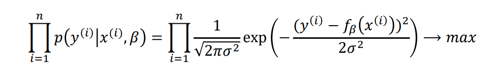

- Eine lineare Gleichung $$f(x)=a*x + b$$ wird gesucht, die einen **möglichst geringen summierten-quadratischen Fehler aufweist**.
- # Fehlerfunktion
	- _sum of squared errors_
	- 
	- Man Berechnet den Abstand vom Ermittelten $$y$$ und dem Tatsächlichen $$y_{i}$$ Werten aus dem Datensatz. Die Quadrierung erfolgt, um negative Werte zu ermitteln. Mit dem Ergebnis kann man die Funktion gezielt verändern => **Ziel ist es das Ergebnis der Funktion zu minimieren**
	- # Lösung des Minimierungsproblems
		- **Maximum Likelihood** => Man geht davon aus, dass die Fehlerfunktion Normalverteilt um 0 ist.
		- 
		- Eine Addition von Wahrscheinlichkeiten ist immer eine Multiplikation
		- $$\prod_{i = 1}^{n}P(y_i|x_i, \beta)$$ bedeutet, die Wahrscheinlichkeit, dass der Wert $$y_{i}$$ eintritt, wenn $$x_{i}$$ mit dem gesuchten Parameter $$\beta$$ der Gerade verwendet wird. Diese Wahrscheinlichkeit soll maximiert werden (also der Parameter $$\beta$$ optimiert werden, da $$x$$ und $$y$$ konstant sind) => Maximierungsproblem
		- [[draws/2022-04-11-12-47-21.excalidraw]]
		-
		- Die Verteilungsfunktion bewegt sich im y-Bereich
		- Der Erwartungswert soll auf der Gerade liegen