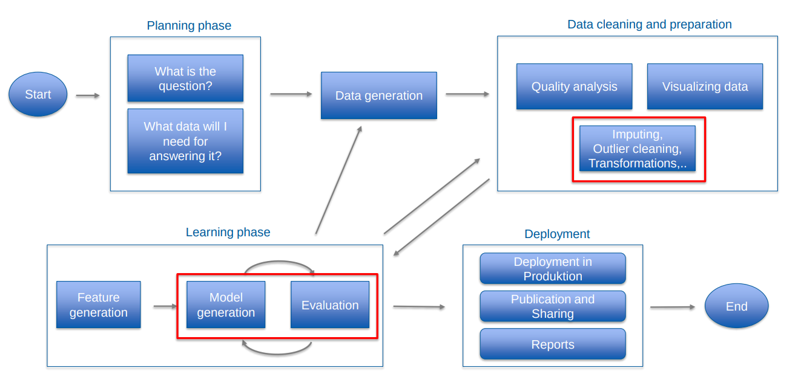

- 
- **Planning Phase** => Blindes finden von Korrelationen ist nicht sinnvoll, da es oft Scheinkorrelationen geben kann.
- **Data Generation** => Das Anlernen von Modellen erfordert viele Daten
- **Learning Phase** und **Data Cleaning and Preparation** wechseln sich ab (Schrttweises Verarbeiten oder Umwandeln/Konvertieren von Daten)