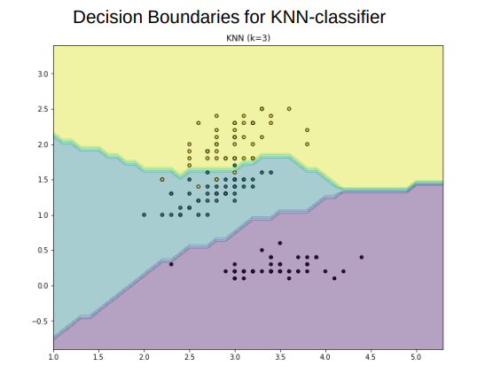

- Die Klassifikation mit mehr als 2 Klassen => Mehrere Decision Boundaries gesucht.
- 
- # Übungsfragen
	- Eine Klassifikation in mehr als 2 Kategorien nennt man {{cloze Mulinomiale Klassifikation}} #card #Classification
	  card-last-interval:: 4
	  card-repeats:: 2
	  card-ease-factor:: 2.6
	  card-next-schedule:: 2022-04-16T07:09:09.169Z
	  card-last-reviewed:: 2022-04-12T07:09:09.169Z
	  card-last-score:: 5