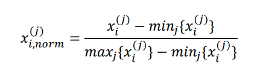
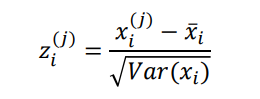

- Oft müssen Eingabeveriablen auf den selben Wertebereich zu normieren, sodass sie **gleich gewichtet sind** und alle Variablen den selben Einfluss auf das Ergebnis haben.
- Da beim Machine Learning Funktionen approximiert werden, sollten die Werte in den selben Werteberich gebracht werden. Es können keine Werte approximiert werden, die nicht im Wertebereich der Funktion liegen
- # Standartnormalisierung
	- Normierung in den Wertebereich $$[0,1]$$
	- 
- # z-Transformation
	- Alle Werte werden auf einen **Erwartungswert bei 0** und eine **Varianz von 1** genormt.
	- 
	- Dieses Vorgehen wird vor allem bei der Bildverarbeitung verwendet