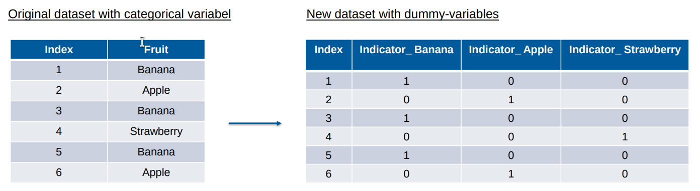

- Man Transformiert eine Spalte, in der die Kategorie steht, in eine Anzahl von Spalten {{cloze wie eine Matrix}}, die die Kategorie angeben. #card
  card-last-interval:: 4
  card-repeats:: 1
  card-ease-factor:: 2.6
  card-next-schedule:: 2022-04-15T08:40:28.979Z
  card-last-reviewed:: 2022-04-11T08:40:28.979Z
  card-last-score:: 5
- Dadurch ordnet man nicht {{cloze wie beim Ordinal Encoding}} die Klassen auf einer 1-Dimensionalen Skala an, die den Klassen verschiedene Distanzen untereinander verleiht. In der n-Dimensionalen Matrix haben alle Klassen den selben Abstand voneinander {{cloze in den "Ecken"}}.
- 