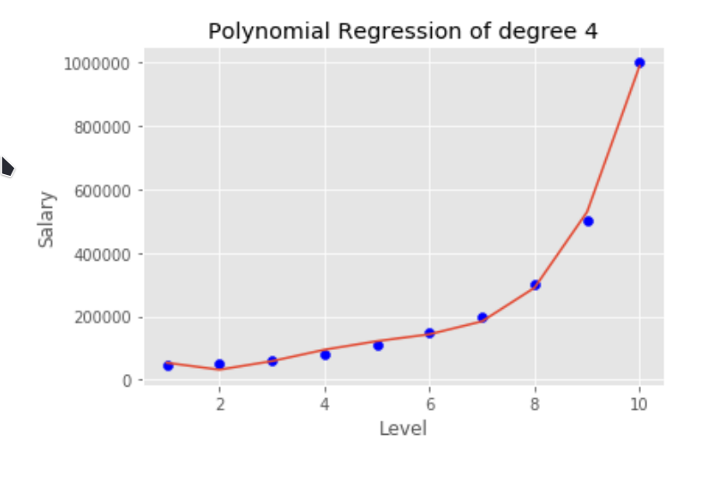

- Regression für nicht-lineare Zusammenhänge mit dem Grad $$k$$.
- 
- $$f(x)=\beta_0 + \beta_1*x + \beta_2*x^2 + ... + \beta_k*x^k$$
- Man muss die optimale Konfiguration von $$[\beta_0,...,\beta_k]$$ finden.
- # Lösung
	- Gelöst wird diese Gleichung mit dem [[Gradient Descent]] Verfahren
-