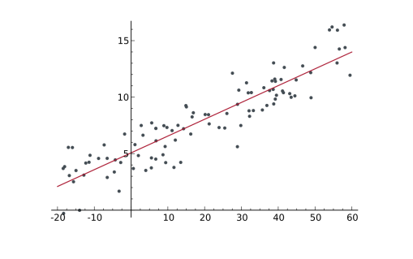

- [[Supervised Learning]] Methode für lineare Zusammenhänge. Das - Ergebnis ist eine **numerische Zahl**. Nicht-lineare Zusammenhänge können nicht gelernt werden.
- {:height 371, :width 618}
- Das Ergebnis ist eine **Hyperplane** (da dimensionsunabhängig).
- Man bestimmt eine Funktion (mit zufälligen Parametern) und versucht diese zu optimieren.
- Der Abstand zu den einzelnen Datenpunkten wird minimiert.
	- **Iterative** => [[Gradient Descent]]
	- **Analytical** => Solving the equation system
- Bei vielen Eingabevariablen ist es wichtig die [[Korrelation]] zu ermitteln und ggf. die Variablen gezielt auszuwählen oder zusammenzufassen.
- # Varianten
	- {{embed [[Lineare Regression]]}}