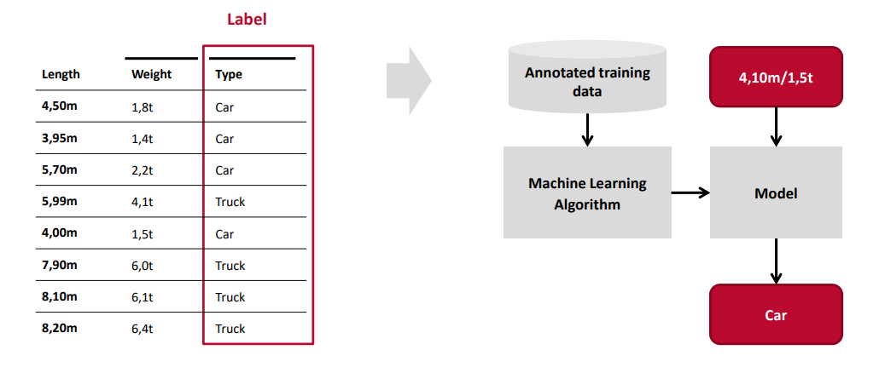

- # Allgemein
	- Das Lernen mit Daten, die bereits klassifiziert oder beschriftet sind.
	- 
	- Es wird versucht, eine *Bezeihung zwischen den Input und Outputvariablen* zu ermitteln.
	- Die Datensätze sind definiert durch
	  * Eine Menge von n-Dimensionalen Eingabevariablen x
	  * Eine Menge von dazugehörigen n-Dimensionalen Ausgabevariablen y
	- Die Funktion f(x) soll /approximiert/ werden, um Ergebnisse zu bestimmen, die nicht im Trainigsdatensatz enthalten sind => *Generalisierung* wird angestrebt
- # Algorithmen
	- [[Discriminative Approach]]
	- [[Generative Approach]]
	- [[Parametric Methods]]
- # Methoden
	- [[Classification]] für diskrete Werte
	- [[Regression]] für kontinuierliche Werte
	- [[k-Nearest Neighbor]]
- # Funktionen
	- {{embed [[Discriminant Functions]]}}
	-