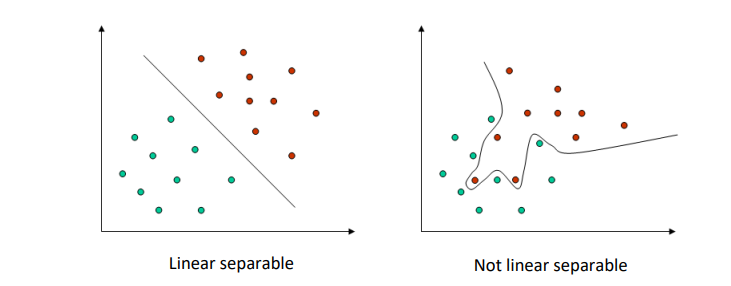

- Ein [[Supervised Learning]] Ansatz, der sich gut für kategorische oder kontinuierliche Variablen eignet
- 
- Die Parameter werden als Vektoren dargestellt und unterteilen den **n-Dimensionalen** Raum in verschiedene Zonen
- Die Distanz der **separierenden Planen** von den Datenpunkten wird maximiert, um die ideale Trennplane zu ermitteln.
- Mit dem [[Kernel Trick]] => Nicht-lineare Zusammenhänge