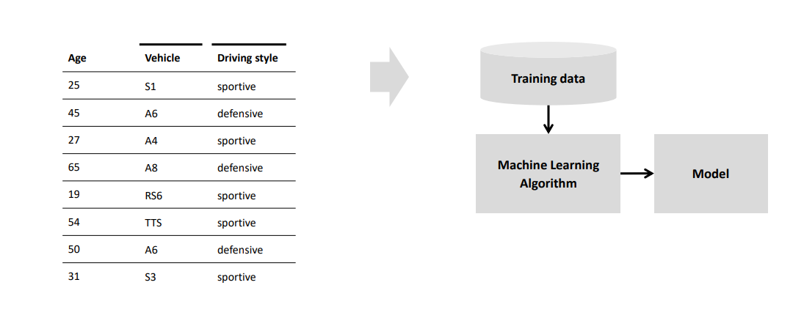

- Die Datensätze sind noch nicht klassifiziert, d.h. **der Algorithmus sucht im Datensatz nach Mustern ohne Überwachtung**.
- Sehr oft ist das Ziel, die Eingabedaten in verschiedene Kategorien aufzuteilen
- Methoden für das Unsupervised Learning sind #card
	- [[Clustering]]
	- Principal Component Analysis
	- Anomaly Detection
	- [[Autoencoders]]
- 