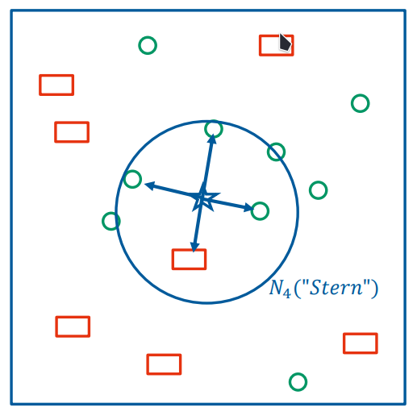
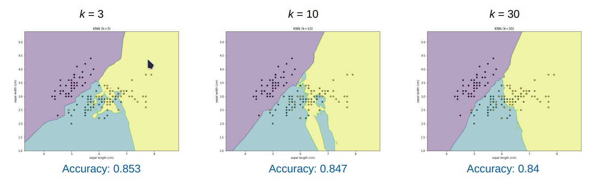
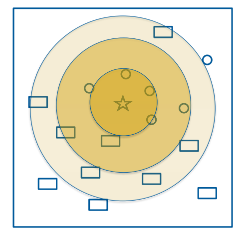
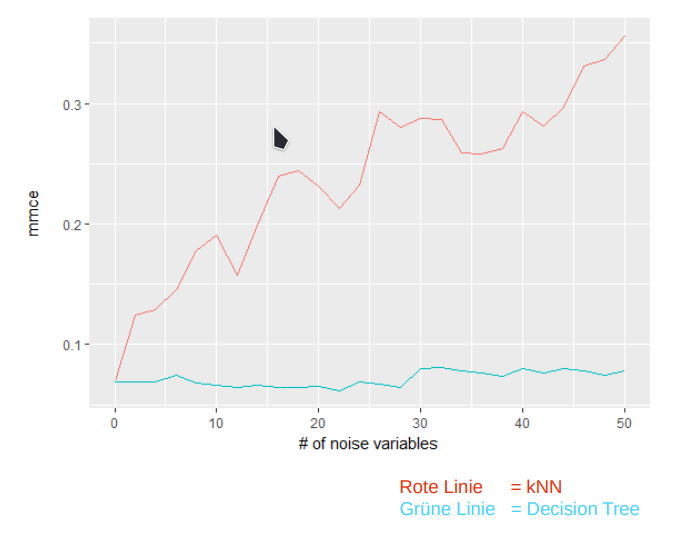

- Ist ein Ansatz des [[Supervised Learning]] zur nicht-linearen **Klassifizierung** und kann nur numerische Daten verarbeiten {{cloze deshalb müssen nicht-numerische Daten (z.B. Kategorisch) durch [[Ordinal Encoding]] umgewandelt werden}}.
- Man fügt einen neuen Datensatz in einen bereits klassifizierten Bereichen {{cloze die möglichst gleich viele Daten besitzten, da sonst die Entscheidung immer bei der Klasse mit den meisten Datensätzen liegt}} hinzu.
- Es werden die nächsten **k**-Nachbaren berechnet und dadurch ermittelt, zu welcher Kategorie der Datensatz gehört.
- 
- Hierfür benötigt man eine **Distanzfunktion**, wie z.B. die _Euklidische Distanzfunktion_
	- Wichtig ist hierbei die [[Normierung]] der Trainigsdaten
- # Rechenaufwand
	- Man hat wenig bis keinen Trainingsaufwand {{cloze da die bestehenden Daten bereits Klassifiziert sind}} , jedoch müssen für jede Vorhersage die nächsten Nachbaren bestimmt werden => Bei großen Datensätzen hohe Laufzeitbelastung.
- # Variable k
	- Die Variable _**k**_ kann frei gewählt werden. Daraus ergibt sich folgender Zusammenhang: #card
		- Wenn _k_ sehr groß => Sehr Rechenaufwendig
		- Wenn _k_ sehr klein => Geringerer Rechenaufwand
	- 
- # Variante: Weighted k-Nearest Neighbor
	- Für alle Klassen gleich viele Datenpunkte vorhanden sein => Ja mehr Punkte einer Klasse es gibt, desto mehr trägt es zum _Voting_ bei.
		- So kann der Stern als Rechteck kategorisiert werden, obwohl er näher an den Kreisen liegt, weil es insgesamt der Rechtecke gibt.
	- 
	- Um das zu lösen, werden die Punkte nach Distanz gewichtet
- # Curse of Dimensionality
	- Der Algorithmus **kann mit hochdimensionalen Daten nicht gut umgehen**. #card
	- Je mehr Dimensionen die Datensätze haben, desto mehr Distanz entsteht zwischen den Datenpunken {{cloze exponentiell}} (siehe [[N-M-Problem]]) => Rauschen hat größere Auswirkungen => Mehr Fehler.
	- 
- # Übungsfragen
	- Allgemeine Eigenschaften des k-Nearest Neighbor sind: #card
		- Zur Klassifizierung
		- Nicht-linear
		- Nur numerische Wertebereiche
	- k-Nearest Neighbor eignet sich {{cloze nicht}} für Hochdimensionale Daten, da {{cloze nach dem _Curse of Dimensionality_ die Distanzen mit zunehmenden Dimensionen wachsen und Rauschen dadurch mehr Einfluss hat}} #card
	- Lernt der k-Nearest Neighbor? Antwort: {{cloze Eigentlich nicht, da man nur die Distanz zu den Punkten bereits Klassifizierter Daten berechnet}} #card